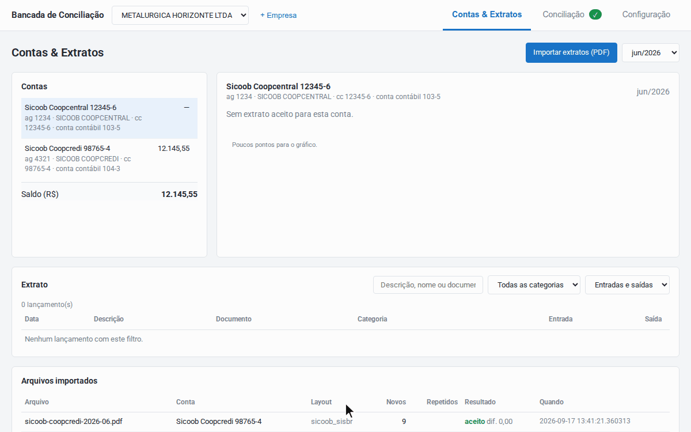
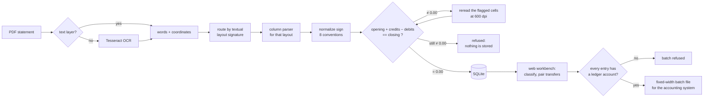
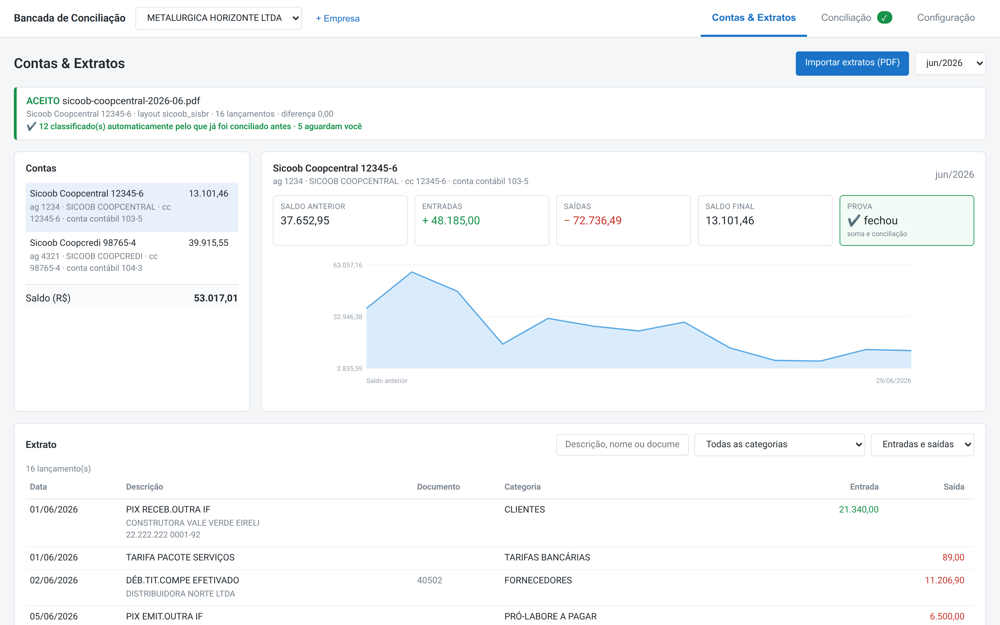
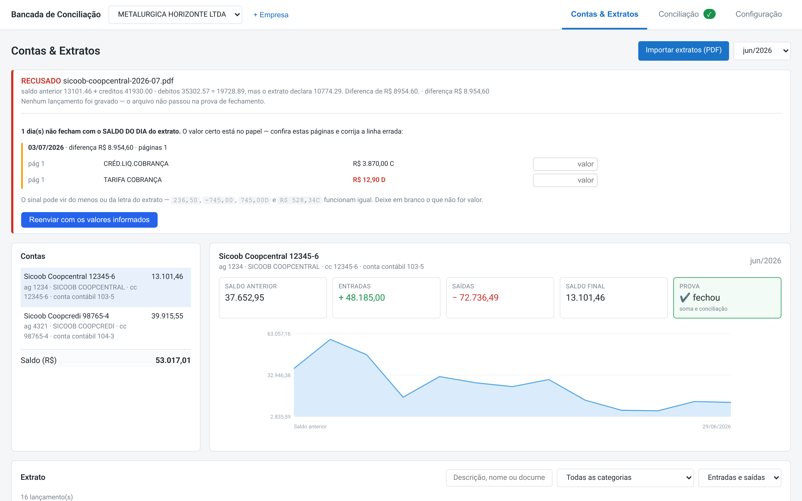
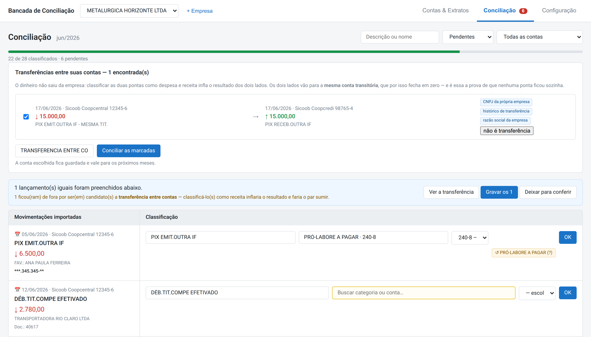
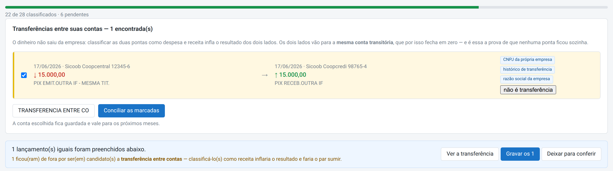
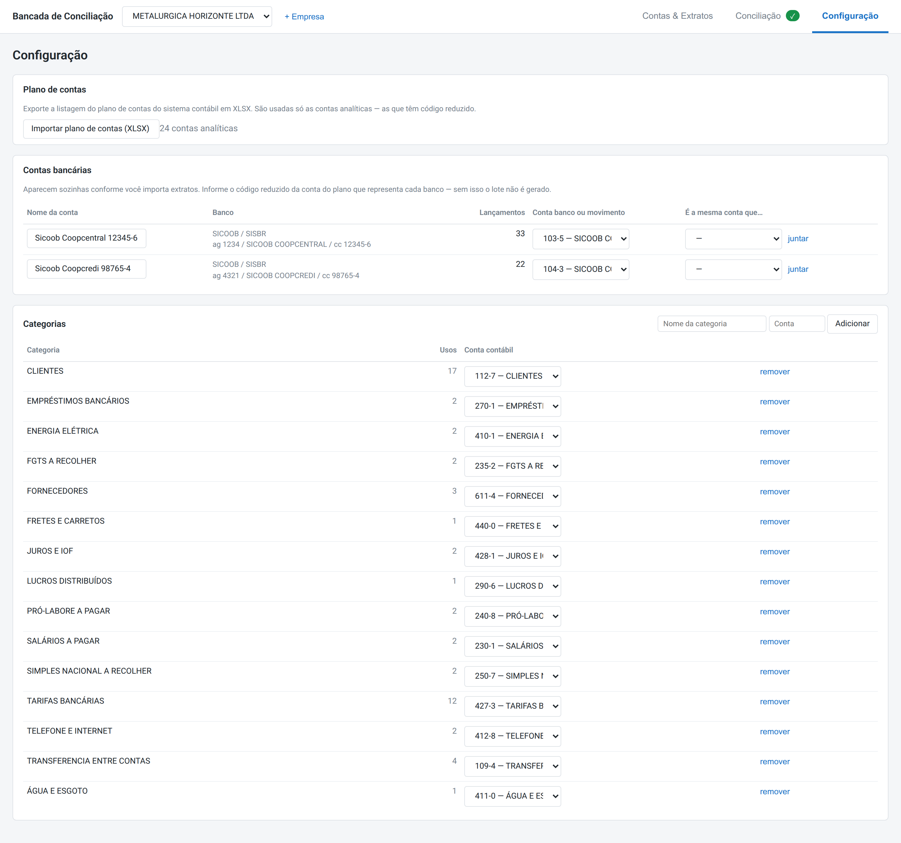
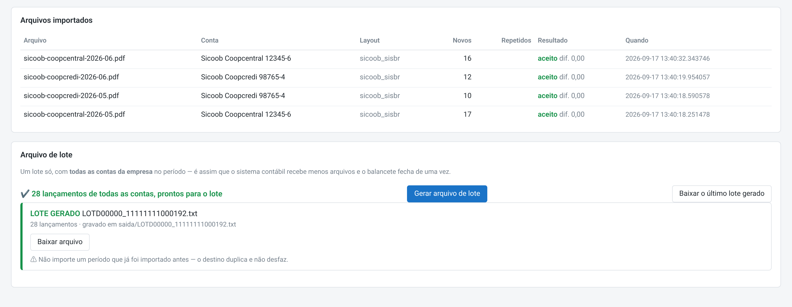
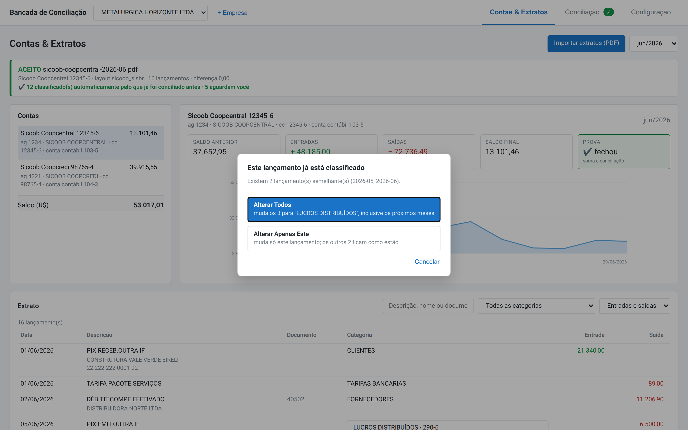

# LedgerFlow · Bank Statement Reconciliation


**Accounting automation in production: multi-bank PDF statement ingestion, arithmetic validation,
reconciliation and ledger export.**

Built for a Brazilian accounting firm. It reads statements from 13 banks in 20 layouts (scanned
ones through OCR), proves that each statement balances to the cent, helps the accountant classify
every entry, and writes the fixed-width batch file that the accounting system imports.



> **About this repository.** This is a showcase with architecture decisions, screenshots of the
> running system and selected source code translated into English. The full source (about 19k
> lines of application code and 7k lines of tests) is private. Additional implementation details
> may be provided for technical review upon request. All data shown here is fictitious.

## What I built

I am the sole developer. I designed and built the system end to end:

- the domain model, with rules gathered from the firm's accountants and from my own experience in
  accounting;
- PDF and OCR parsing;
- reconciliation workflows and the web workbench;
- the test strategy and the deployment package.

I maintain it in production, where the firm's accounting team uses it.

**How it was built:** AI-assisted, spec-driven development (SDD) with Claude Code.

- **Specs before code.** The statement ingestion and the batch exporter each went through written
  brainstorm, requirements, design and build-report documents before shipping.
- **Specialized agents.** I defined AI agents for statement parsing, bank reconciliation,
  accounting classification, export and accounting review.
- **The same bar for every change.** A change had to pass the test suite. A parser change was also
  compared entry by entry against the corpus fingerprint, and every difference had to be explained.

## The problem

Every month, clients send bank statements as PDFs, and someone turns each line into an accounting
entry. The errors are silent: a line lost at a page break, a `D` read as `C`, a month imported
twice, a `7` that OCR read as `1`. The trial balance comes out wrong, and nobody knows why.

Almost all of these errors share one property: **the statement stops adding up.** The system is
built around that fact.

## How it works



| Component | Responsibility |
|---|---|
| **statement** | PDF → normalized entries, with the balance proof. No database, no network |
| **workbench** | FastAPI + SQLite: persistence, classification suggestions, transfer pairing, login, audit trail, and a vanilla-JS web UI |
| **export** | Classified entries → the accounting system's fixed-width import file |

## Screenshots

The UI is in Brazilian Portuguese because its users are Brazilian accountants. A glossary of the
on-screen terms is at the end of this section.

**Every statement must reconcile to the cent before anything is saved.** The proof box turns green
only when the numbers close *and* every entry is classified.



**A statement with one missing line is refused whole.** Nothing is written, and the daily running
balance points to the day and page to check.



**The reconciliation queue suggests; it doesn't decide.** It offers to apply a decision to
identical entries, and holds back one that looks like an internal transfer.



**Internal transfers are paired from evidence, not from amount and date alone.** Both legs go to a
transit account that must net to zero.



<details>
<summary><b>More screenshots:</b> configuration, batch export, reclassification scope</summary>

**Per-company setup:** chart of accounts, the ledger account for each bank account, and category →
ledger account.



**One batch file for every account in the period.** Re-exporting a period requires explicit
confirmation.



**Changing a classified entry asks for the scope:** all similar entries, or only this one.



</details>

<details>
<summary><b>Glossary of the terms on screen</b></summary>

| On screen | Meaning |
|---|---|
| Contas & Extratos · Conciliação · Configuração | Accounts & Statements · Reconciliation · Settings |
| ACEITO / RECUSADO | Accepted / Refused |
| Saldo anterior / Saldo final | Opening / Closing balance |
| Entradas / Saídas | Credits / Debits |
| PROVA · fechou | Proof · balanced |
| SALDO DO DIA | Daily balance, as printed by the bank |
| Lançamento · Plano de contas · Conta contábil | Entry · Chart of accounts · Ledger account |
| Gerar arquivo de lote | Generate batch file |

</details>

## Engineering highlights

Each decision has an [architecture decision record](docs/decisions/) with the alternatives that
were rejected and the measurements behind it.

- **Fail-closed at every boundary.** A statement that doesn't close at exactly `0.00` is refused and
  nothing is stored; one entry without a ledger account refuses the whole batch.
  [ADR 1](docs/decisions/0001-fail-closed-balance-gate.md) · [ADR 8](docs/decisions/0008-export-batch-all-or-nothing.md)
- **OCR corrections are verified, never deduced.** Arithmetic says *where* to look, a 600-dpi
  reread of that one cell says *what* is there, and arithmetic *checks* it.
  [ADR 3](docs/decisions/0003-ocr-corrections-verified-not-deduced.md)
- **Layouts are data.** 20 layouts are registered in YAML with measured geometry, and a statement is
  routed by the text it prints, never by the PDF producer.
  [ADR 2](docs/decisions/0002-layouts-are-data-routed-by-signature.md)
- **Idempotent by construction.** Deduplication is a `UNIQUE` constraint on a canonical identity,
  so importing a statement twice creates nothing.
  [ADR 4](docs/decisions/0004-deduplication-is-a-database-constraint.md)
- **Suggestions, not silent rules.** Auto-apply happens only at confidence 1.0. On real statements,
  3,255 entries needed 380 decisions.
  [ADR 5](docs/decisions/0005-suggestions-not-rules.md)
- **Transfers prove themselves.** A transit account that nets to zero shows that no leg was left
  without a pair. [ADR 6](docs/decisions/0006-transfers-proven-by-a-zero-transit-account.md)
- **Secure by default.** Auth is a path-keyed middleware, the server refuses to start on a network
  address without login, and every change is audited.
  [ADR 7](docs/decisions/0007-secure-by-default-for-a-small-team.md)
- **Money is never a float:** it is `Decimal` from the PDF to the batch file.

## Results on real statements

| | |
|---|---|
| Private corpus | 67 PDFs from 13 banks, in 20 layouts; 17 of them are scanned |
| Accepted at `0.00` | **59**, totaling 20,339 entries |
| Refused | 8, **none of them a misread**: unknown layouts or page crops, a missing opening balance, an entry outside the period, one unreadable cell |
| Export | Regenerates a real batch **byte for byte** (466 records, 249,046 bytes); a generated batch was imported and accepted by the accounting system |

## Testing

- **473 tests in CI** on Python 3.10 and 3.12, with no real data and no Tesseract. They include
  **end-to-end tests on a synthetic statement**, a PDF written byte by byte and read by the
  production parser. Removing a line or flipping a sign gets it refused, re-importing it creates
  nothing, and the batch refuses to generate while an entry is unclassified. The tests were checked
  against deliberate sabotage: removing the `UNIQUE` constraint or adding a tolerance to the gate
  makes them fail.
- **About 400 more tests run privately** against the real statements.
- **Corpus fingerprinting:** every parser change is compared entry by entry across the whole corpus,
  because a green test suite alone doesn't prove the corpus is still read the same way.

## In this repository

```text
docs/decisions/    8 architecture decision records
docs/screenshots/  the running system, with fictitious data
code-samples/      28 selected files translated into English, with a reading guide
                   (parsing · workbench API · web UI · export · tests)
```

Start with the [code samples reading guide](code-samples/README.md).

**Stack:** Python · pdfplumber · Tesseract OCR · Pydantic · SQLite · FastAPI · vanilla JavaScript ·
pytest · GitHub Actions

---

## Contact

**Luiz Ferreira** · [LinkedIn](https://www.linkedin.com/in/luiz-ferreira-junior-69496a144/) ·
[GitHub](https://github.com/luizferreiraj)

© 2026 Luiz Ferreira. All rights reserved. Published for portfolio review; no license is granted to
use, copy or distribute this code.
