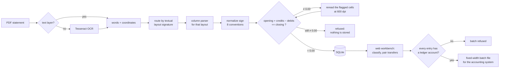

# LedgerFlow · Bank Statement Reconciliation

**Turns the PDF bank statements an accounting firm receives into accounting entries, and proves
arithmetically that nothing was lost, duplicated or had its sign flipped.**

It is in production at a Brazilian accounting firm. It reads statements from 13 banks in 20
layouts, including scanned ones through OCR. It helps the accountant classify every entry, and it
writes the fixed-width batch file that the accounting system imports.


> **About this repository.** This is a showcase: architecture decisions, screenshots of the running
> system and selected source code, translated into English. The full source (about 19k lines of
> application code and 7k lines of tests, 473 of them running in CI) is private and **available for
> review on request** ([contact](#contact)). All data shown here is fictitious.

---

## The problem

Every month, clients send their bank statements as PDFs. Someone has to turn each line into an
accounting entry, and the errors are silent:

- a line lost at a page break;
- a `D` read as `C`;
- the same month imported twice;
- a `7` that OCR read as `1`.

The trial balance comes out wrong, and nobody knows why, or even that it is wrong.

Almost all of these errors share one property: **the statement stops adding up.** The system is
built around that fact.

## How it works



| Component | Responsibility |
|---|---|
| **statement** | PDF → normalized entries, with the balance proof. No database, no network |
| **workbench** | FastAPI + SQLite: persistence, classification suggestions, transfer pairing, login, audit trail, and a vanilla-JS web UI |
| **export** | Classified entries → the accounting system's fixed-width import file (`latin-1`, `CRLF`, header/entry/trailer records) |

## Screenshots

The UI is in Brazilian Portuguese because its users are Brazilian accountants. A short glossary of
the terms on screen follows the screenshots.

**Every statement has to reconcile to the cent before anything is saved.** The proof box turns
green only when the numbers close *and* every entry is classified. Here 12 of the 16 entries were
classified automatically from the accountant's earlier decisions.


**A statement with one missing line is refused whole.** Nothing is written, and the daily running
balance points to the exact day and page to check. A value typed by a person goes through the same
gate.


**The reconciliation queue suggests; it doesn't decide.** After one entry is classified, the system
offers to apply the same decision to identical entries. It holds back a receipt that looks like an
internal transfer, because classifying it as revenue would inflate income and hide the pair. The
`(?)` marks a doubtful suggestion: the same case received two different categories in the past.


**Internal transfers are paired from evidence, never from amount and date alone.** The evidence is
the company's own CNPJ, transfer wording and the legal name. Both legs go to one transit account,
which has to net to zero.


<details>
<summary><b>More screenshots:</b> configuration, batch export, reclassification scope</summary>

**Per-company setup:** the chart of accounts imported from the accounting system's spreadsheet,
the ledger account for each bank account, and category → ledger account. A bank account's ledger
code is never guessed; the batch refuses to run until someone sets it.


**One batch file for every account in the period,** generated only when every entry has a ledger
account. The batch is one-way (importing it twice duplicates everything at the destination), so
every export is logged and re-exporting a period requires explicit confirmation.


**Changing a classified entry asks for the scope,** with the consequence written on each button:
all similar entries including future months, or only this one. "Only this one" is stored as an
exception, so a single correction doesn't erode the suggestion for the rest of the group.


</details>

<details>
<summary><b>Glossary of the terms on screen</b></summary>

| On screen | Meaning |
|---|---|
| Contas & Extratos | Accounts & Statements |
| Conciliação | Reconciliation |
| Configuração | Settings |
| Importar extratos | Import statements |
| ACEITO / RECUSADO | Accepted / Refused |
| Saldo anterior / Saldo final | Opening / Closing balance |
| Entradas / Saídas | Credits / Debits |
| PROVA · fechou | Proof · balanced |
| SALDO DO DIA | Daily balance, as printed by the bank |
| Lançamento | Entry |
| Plano de contas / Conta contábil | Chart of accounts / Ledger account |
| Transferências entre suas contas | Transfers between your own accounts |
| Gerar arquivo de lote | Generate batch file |

</details>

## Engineering highlights

Each decision is written up as an [architecture decision record](docs/decisions/), with the
alternatives that were rejected and the measurements behind the choice.

- **Fail-closed at every boundary.**
  - A statement that doesn't close at exactly `0.00` is refused, and nothing is stored.
  - One entry without a ledger account refuses the whole batch.
  - If the identity provider is down, nobody logs in.
  - [ADR 1](docs/decisions/0001-fail-closed-balance-gate.md) · [ADR 8](docs/decisions/0008-export-batch-all-or-nothing.md)
- **OCR corrections are verified, never deduced.**
  - The arithmetic says *where* to look, a 600-dpi reread of that one cell says *what* is there, and
    the arithmetic *checks* it.
  - Deducing the value from the difference would close by construction, even when it's wrong.
  - [ADR 3](docs/decisions/0003-ocr-corrections-verified-not-deduced.md)
- **Layouts are data.**
  - 20 layouts are registered in YAML, with measured geometry, and a statement is routed by the
    text it prints, never by the PDF producer.
  - An unknown layout is refused with the signature it observed.
  - [ADR 2](docs/decisions/0002-layouts-are-data-routed-by-signature.md)
- **Idempotent by construction.**
  - Deduplication is a `UNIQUE` constraint on a canonical identity plus ordinal, not a function
    someone has to remember to call.
  - Re-importing after a parser fix corrects descriptions in place and keeps the classification.
  - [ADR 4](docs/decisions/0004-deduplication-is-a-database-constraint.md)
- **Suggestions, not silent rules.**
  - The suggestion key depends on the direction of the money, and auto-apply happens only at
    confidence 1.0.
  - Measured on real statements: 3,255 entries needed 380 decisions.
  - [ADR 5](docs/decisions/0005-suggestions-not-rules.md)
- **Transfers prove themselves.**
  - A transit account that nets to zero proves no leg was left without a pair.
  - Amount and date alone matched 20 times between unrelated companies, so a person confirms every
    pair.
  - [ADR 6](docs/decisions/0006-transfers-proven-by-a-zero-transit-account.md)
- **Secure by default.**
  - Authentication is a middleware keyed on the path, so a new route is protected by default.
  - The server refuses to start on a network address without login, and every change is written to
    an audit trail.
  - [ADR 7](docs/decisions/0007-secure-by-default-for-a-small-team.md)
- **Money is never a float.** It is `Decimal` from the PDF to the batch file, and exact decimal
  text in SQLite.

## Measured on real statements

| | |
|---|---|
| Statements in the private corpus | 67 PDFs, 13 banks, 20 layouts |
| Scanned, with no text layer | 17; 13 of them are read through OCR |
| Accepted, closing at `0.00` | **59**, totaling 20,339 entries |
| Refused | 8, and **none of them is a misread**: 4 unknown layouts (3 are page crops, not statements), 2 statements that don't print an opening balance, 1 entry outside the declared period, 1 cell unreadable even after the reread |
| Export | Fed with a batch the firm had already imported, the writer regenerates it **byte for byte** (466 records, 249,046 bytes). A generated batch was imported and accepted by the accounting system |

## How it is tested

- **473 tests in CI** (Python 3.10 and 3.12) that need no real data and no Tesseract.
- **End to end on a synthetic statement.** A PDF is written byte by byte and read by the production
  parser. The suite checks that it is accepted at `0.00`, that removing a line or flipping a sign
  gets it refused, that re-importing it (even re-downloaded with different bytes) creates nothing,
  and that the batch refuses to generate while any entry is unclassified. These tests were checked
  against deliberate sabotage: removing the `UNIQUE` constraint or adding a tolerance to the gate
  makes them fail. See [`test_synthetic_statement.py`](code-samples/tests/test_synthetic_statement.py)
  and [`test_end_to_end.py`](code-samples/tests/test_end_to_end.py).
- **About 400 more tests run privately** against the real statements: exact balances, entry counts,
  specific lines on specific pages.
- **Corpus fingerprinting.** Every parser change is checked by fingerprinting every entry in the
  corpus (date, description, amount, direction) before and after. A green test suite alone doesn't
  prove that the corpus is still read the same way; this was measured three times, with changes
  that passed every test and would have corrupted real entries.

## What's in this repository

```text
docs/decisions/    8 architecture decision records
docs/screenshots/  the running system, with fictitious data
code-samples/      25 selected files, translated into English, with a reading guide
```

Start with the [code samples reading guide](code-samples/README.md). The 20 layout parsers, the
full API and web UI, the repository layer and the accounting system's batch layout are not
published.

## Tech stack

Python · pdfplumber · Tesseract OCR · Pydantic · PyYAML · SQLite · FastAPI · Uvicorn · vanilla
JavaScript, HTML and CSS (no framework, no build step) · pytest · GitHub Actions

---

## Contact

**Luiz Ferreira**

- LinkedIn: [luiz-ferreira-junior](https://www.linkedin.com/in/luiz-ferreira-junior-69496a144/)
- Email: [luizferreirajr99@gmail.com](mailto:luizferreirajr99@gmail.com)
- GitHub: [luizferreiraj](https://github.com/luizferreiraj)

© 2026 Luiz Ferreira. All rights reserved. Published for portfolio review; no license is granted to
use, copy or distribute this code.
